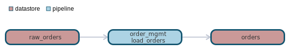

`data classification: `

# datastore:orders

- [General](#general)
- [Dependencies](#dependencies)
- [Dependants](#dependants)

# General 

orders table

# Schema
| Column    | Type        | Comments |
| --------- | ----------- | -------- |
| order_id | int | order number |
| customer_id | double | customer number |
| name | string | customer name |

# Dependencies Lineage 

- [pipeline - order_mgmt.load_orders](pipelines/order_mgmt/load_orders/load_orders.md)
- [datastore - raw_orders](datastores/raw_orders/raw_orders.md)

# Dependants Lineage 

No dependants found

