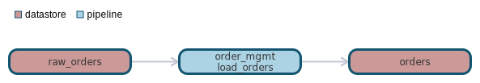

`data classification: `

# datastore:raw_orders

- [General](#general)
- [Dependencies](#dependencies)
- [Dependants](#dependants)

# General 

raw_orders loaded from export files in ELT

# Schema
| Column    | Type        | Comments |
| --------- | ----------- | -------- |
| order_id | int | order number |
| customer_id | int |  |

# Dependencies Lineage 

No dependencies found

# Dependants Lineage 

- [pipeline - order_mgmt.load_orders](pipelines/order_mgmt/load_orders/load_orders.md)
- [datastore - orders](datastores/orders/orders.md)

- [pipeline - order_mgmt.load_orders](pipelines/order_mgmt/load_orders/load_orders.md)
- [datastore - orders](datastores/orders/orders.md)

