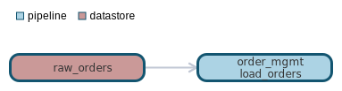
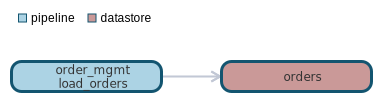

`data classification: PII`
        `triggers: file_arrival`

# pipeline:order_mgmt.load_orders

- [General](#general)
- [Dependencies](#dependencies)
- [Dependants](#dependants)

# General <a name="general"></a>
Loads orders from raw order system. Performs the following calculation on order value:
  ```order_value = order_qty * order_line_item_value```


# Dependencies Lineage <a name="dependencies"></a>



- [datastore - raw_orders](datastores/raw_orders/raw_orders.md)

# Dependants Lineage <a name="dependants"></a>



- [datastore - orders](datastores/orders/orders.md)

# Direct Sources


# Targets


# Flow

