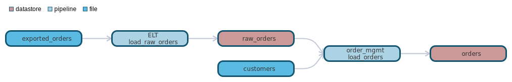

`data classification: `

# datastore orders

- [General](#general)
- [Schema](#schema)
- [Dependencies](#dependencies)
- [Dependants](#dependants)

# General 

orders table

# Schema 
| Column    | Type        | Comments |
| --------- | ----------- | -------- |
| order_id | int | order number |
| customer_id | double | customer number |
| name | string | customer name |

# Dependencies Lineage 

- [pipeline - order_mgmt.load_orders](https://github.com/datayoga-io/lineage/blob/master/example/output/pipelines/order_mgmt/load_orders/load_orders.md)
- [datastore - raw_orders](https://github.com/datayoga-io/lineage/blob/master/example/output/datastores/raw_orders/raw_orders.md)
- [pipeline - ELT.load_raw_orders](https://github.com/datayoga-io/lineage/blob/master/example/output/pipelines/ELT/load_raw_orders/load_raw_orders.md)
- [file - exported_orders](https://github.com/datayoga-io/lineage/blob/master/example/output/files/exported_orders/exported_orders.md)
- [file - customers](https://github.com/datayoga-io/lineage/blob/master/example/output/files/customers/customers.md)

# Dependants Lineage 

No dependants found

