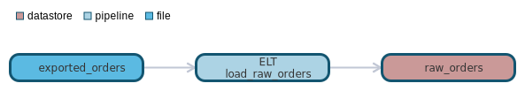
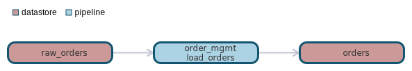

`data classification: `

# datastore raw_orders

- [General](#general)
- [Schema](#schema)
- [Dependencies](#dependencies)
- [Dependants](#dependants)

# General 

raw_orders loaded from export files in ELT

# Schema 
| Column    | Type        | Comments |
| --------- | ----------- | -------- |
| order_id | int | order number |
| customer_id | int |  |

# Dependencies Lineage 

- [pipeline - ELT.load_raw_orders](https://github.com/datayoga-io/lineage/blob/master/example/output/pipelines/ELT/load_raw_orders/load_raw_orders.md)
- [file - exported_orders](https://github.com/datayoga-io/lineage/blob/master/example/output/files/exported_orders/exported_orders.md)

# Dependants Lineage 

- [pipeline - order_mgmt.load_orders](https://github.com/datayoga-io/lineage/blob/master/example/output/pipelines/order_mgmt/load_orders/load_orders.md)
- [datastore - orders](https://github.com/datayoga-io/lineage/blob/master/example/output/datastores/orders/orders.md)

- [pipeline - order_mgmt.load_orders](https://github.com/datayoga-io/lineage/blob/master/example/output/pipelines/order_mgmt/load_orders/load_orders.md)
- [datastore - orders](https://github.com/datayoga-io/lineage/blob/master/example/output/datastores/orders/orders.md)

