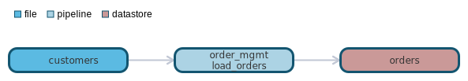

`data classification: `

# file:customers

- [General](#general)
- [Schema](#schema)
- [Dependencies](#dependencies)
- [Dependants](#dependants)

# General 

Filename: customer_full.json
Format: json

# Schema 
| Column    | Type        | Comments |
| --------- | ----------- | -------- |
| customer_id | int  | customer identifier |
| address | record  |  |

# Dependencies Lineage 

No dependencies found

# Dependants Lineage 

- [pipeline - order_mgmt.load_orders](https://github.com/datayoga-io/lineage/blob/main/example/output//pipelines/order_mgmt/load_orders/load_orders.md)
- [datastore - orders](https://github.com/datayoga-io/lineage/blob/main/example/output//datastores/orders/orders.md)

