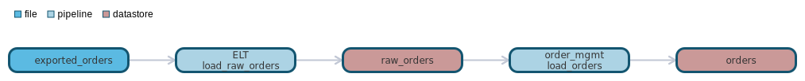

`data classification: `

# file:exported_orders

- [General](#general)
- [Schema](#schema)
- [Dependencies](#dependencies)
- [Dependants](#dependants)

# General 

Filename: orders_{[0-9]}6.csv
Format: delimited
Delimiter: ,

# Schema 
| Column    | Type        | Comments |
| --------- | ----------- | -------- |
| order_id | int  | order number |
| order_date | date MM/dd/YYYY |  |

# Dependencies Lineage 

No dependencies found

# Dependants Lineage 

- [pipeline - ELT.load_raw_orders](https://github.com/datayoga-io/lineage/blob/main/example/output//pipelines/ELT/load_raw_orders/load_raw_orders.md)
- [datastore - raw_orders](https://github.com/datayoga-io/lineage/blob/main/example/output//datastores/raw_orders/raw_orders.md)
- [pipeline - order_mgmt.load_orders](https://github.com/datayoga-io/lineage/blob/main/example/output//pipelines/order_mgmt/load_orders/load_orders.md)
- [datastore - orders](https://github.com/datayoga-io/lineage/blob/main/example/output//datastores/orders/orders.md)

