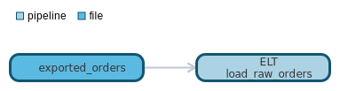
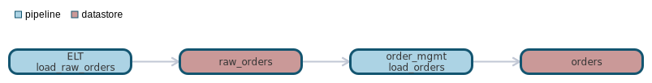

`data classification: PII`
        `triggers: file_arrival`

# pipeline pipeline:ELT.load_raw_orders

- [General](#general)
- [Dependencies](#dependencies)
- [Dependants](#dependants)

# General <a name="general"></a>
Loads orders from raw order system. Performs the following calculation on order value:
  ```order_value = order_qty * order_line_item_value```


# Dependencies Lineage <a name="dependencies"></a>


- [file - exported_orders](https://github.com/datayoga-io/lineage/blob/main/example/output//files/exported_orders/exported_orders.md)

# Dependants Lineage <a name="dependants"></a>


- [datastore - raw_orders](https://github.com/datayoga-io/lineage/blob/main/example/output//datastores/raw_orders/raw_orders.md)
- [pipeline - order_mgmt.load_orders](https://github.com/datayoga-io/lineage/blob/main/example/output//pipelines/order_mgmt/load_orders/load_orders.md)
- [datastore - orders](https://github.com/datayoga-io/lineage/blob/main/example/output//datastores/orders/orders.md)

# Direct Sources


# Targets


