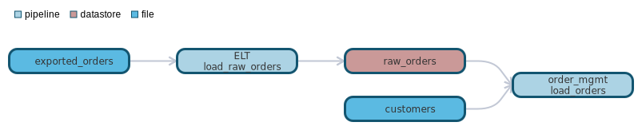
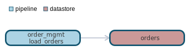

`data classification: `

# pipeline order_mgmt.load_orders

- [General](#general)
- [Dependencies](#dependencies)
- [Dependants](#dependants)

# General 

# Dependencies Lineage 

- [datastore - raw_orders](datastores/raw_orders/raw_orders.md)
- [pipeline - ELT.load_raw_orders](pipelines/ELT/load_raw_orders/load_raw_orders.md)
- [file - exported_orders](files/exported_orders/exported_orders.md)
- [file - customers](files/customers/customers.md)

# Dependants Lineage 

- [datastore - orders](datastores/orders/orders.md)

# Direct Sources

# Targets

